# O que é
Repositório destinado ao desenvolvimento e implementação de bibliotecas, interfaces e códigos fonte para o controle da central de acionamentos através do STM32F103c8t6.

# Software necessário
Para gerarmos o arquivo .bin necessário para gravar o código na placa STM32F1, estamos utilizando as ferramentas abaixo.
- Java 8 JDK - http://www.oracle.com/technetwork/java/javase/downloads/index.html

      Instale-o em seu caminho padrão. 
      É recomendado instalar a versão 8u152. A mais recente (9.0.1) não funcionou com o eclipse.
      O java é necessário para podermos rodar o Eclipse.

- IDE: Eclipse Neon -  https://github.com/gnu-mcu-eclipse/org.eclipse.epp.packages/releases

      A princípio, pode ser extraído para qualquer local, mas sugiro que o diretório padrão seja "/usuários/(usuário)/gnuarmeclipse"
      Essa instalação já vem com plugins interessantes e é portável. 
      
      
- Compilador: GNU ARM Embedded Toolchain -  https://launchpad.net/gcc-arm-embedded/+milestone/4.9-2015-q3-update
      
      
      Instale-o em seu caminho padrão.
      A versão utilizada é a 4.9.3, pois li que versões acima de 6 não são compatíveis com a biblioteca MBED. Podemos, porém, tentar a versão 5.
      
- Windows Build Tools: https://github.com/gnu-mcu-eclipse/windows-build-tools/releases
      
      Instale-o em seu caminho padrão.
        
# Importando o projeto do MBED para o Eclipse
- Acesse o projeto no MBED, clique com o botão direito e selecione "Export Program" 
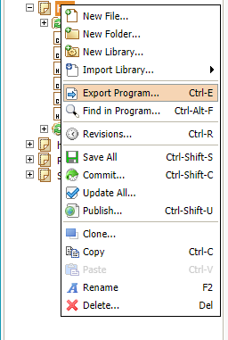 
- Escolha a opção Gnu Arm Eclipse  
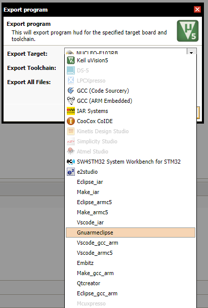 
- Extraia o .zip resultante no diretório de escolha (por padrão, "/usuários/(usuário)/gnuarmeclipse/projects") 
- Abra o  Eclipse. Escolha o diretório de workspace (por padrão, "/usuários/(usuário)/gnuarmeclipse/projects") 
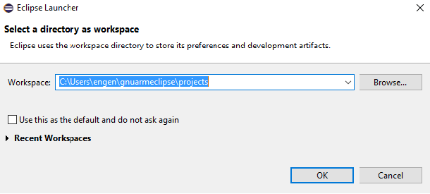  
- Abra o projeto que você exportou do MBED 
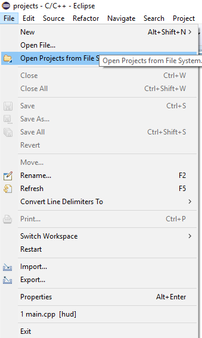 
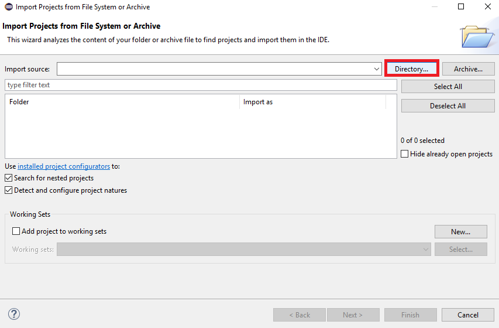 
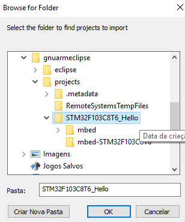 
Após selecionar a pasta do projeto, clique em 'Finish'. O projeto deve ter sido adicionado à barra lateral esquerda do Eclipse.

- Clique com o botão direito no projeto e selecione "Properties". Em C/C++ Build -> Settings -> Tool Settings, verifique os campos "Toolchain path" e "Build Tools path".  
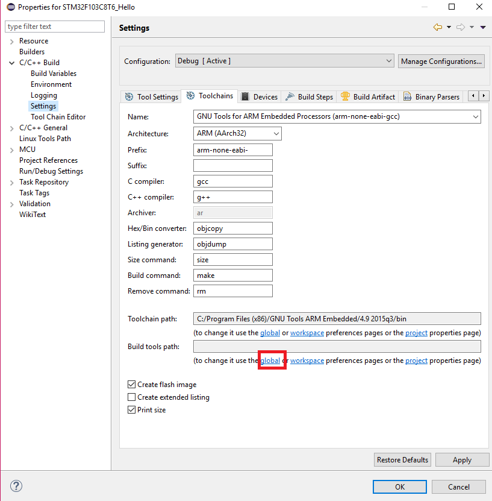 
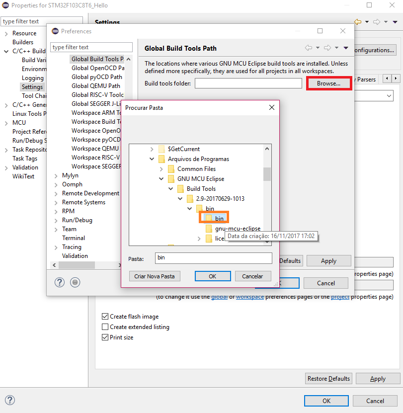 

       O Eclipse precisa do Path acessar essas ferramentas. Em caso de dúvida sobre subpasta selecionar: Para o Compilador (Toolchain), a pasta a ser selecionada é a que contém vários arquivos com o prefixo "arm-none-eabi". Para a Build Tools, a pasta é a que contém os arquivos "make", "mkdir", etc. 

 
- Tente compilar o projeto e veja os erros resultantes 
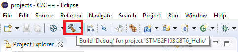  
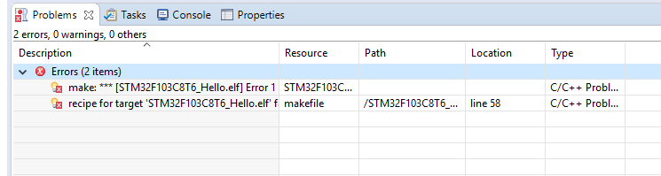  
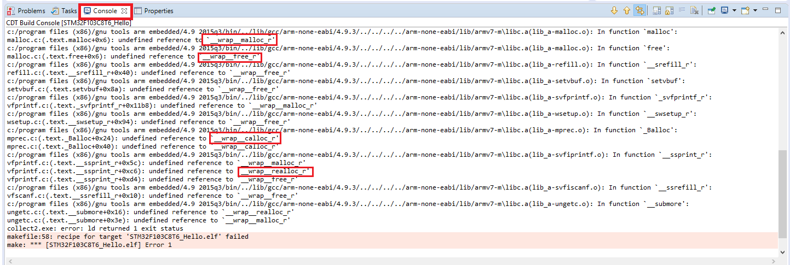 
     
     Note no console as funções (?) que tiveram "undefined reference to __wrap__ALGO". Essas serão as que precisaremos alterar no passo seguinte.
 
  
- Adicione um underline *_* em algumas linker flags  
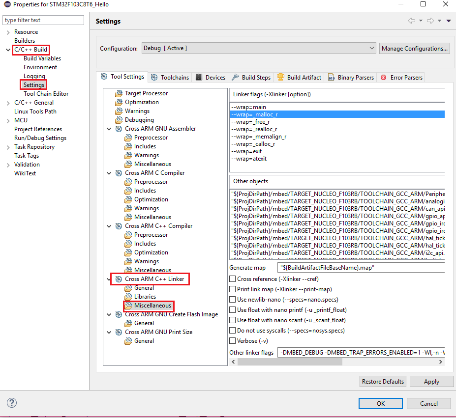  
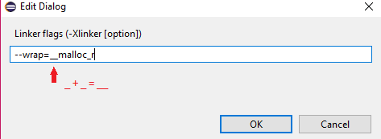 
Faça isso para malloc, realloc, free e calloc.
 
- Clique em Build e seja feliz 
  
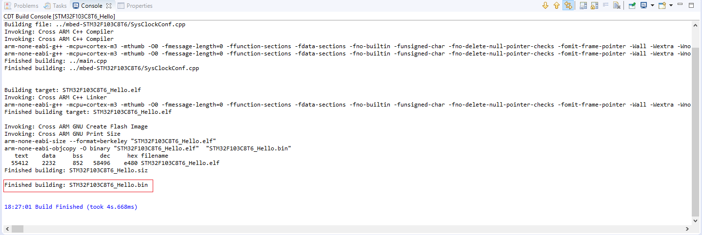 

# Guias utilizados
- https://gnu-mcu-eclipse.github.io/install/
- Compilador: https://gnu-mcu-eclipse.github.io/toolchain/arm/install/
- Build Tools: https://gnu-mcu-eclipse.github.io/windows-build-tools/install/
